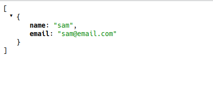

# Node.js Events Exercise

### SignUp Page

### Results Page 

### Error Page

## Exercise:

### Objectives

- Your objective is to create a server that can handle a post request to “/newsletter_signup”
- You must read and decode the request body (which will contain a name and email), and append the contact information to a csv file (your newsletter list)
- CONSTRAINT: When the client request is a “POST” method to the url “/newsletter_signup”, you will emit a ‘signup’ event. A listener associated with this event will handle your logic

### Getting Started

- Clone and open node_events in VSC
- Open server.js file
- Import “EventEmitter” from the events module
- You will also need the path, http, and fs modules imported to use

### PART 1:

- Using the EventEmitter class, create a new EventEmitter instance called “NewsLetter”
- Instantiate a new server instance with createServer
- Inside the server request handler, listen for the ‘data’ event to be emitted, and pass in a callback function that pushes each ‘chunk’ into an array named ‘chunks’
- Listen for the request ReadStream ‘end’ event, and pass in a callback that contains a conditional statement (if/else)
- The conditional statement will check the request url and method, and if they are “POST” and “/newsletter_signup”, decode the chunks array with Buffer.concat().toString(), and use JSON.parse() on the result to access the request body values
- Next, emit a ‘signup’ event, and pass in the value to be used by your event listener callback (name + email for csv record)
- Write and end the response to the client

### PART 2

- Account for any method or url that is not “POST” + “/newsletter_signup”
- Outside of your server request handler, add an event listener for a ‘signup’ event on the NewsLetter EventEmitter
- Pass in a callback that takes in a ‘contact’ as a parameter
- This function should use fs.appendFile() to add the contact to a csv file in your project directory
- Account for errors
- Initialize the node app and test with Postman

### BONUS

- A get request to your “/newsletter_signup” endpoint should send back an html page with a form
- This form should have labels and inputs for name and email
- This form should send the name and email as the request body to your server to process and add to your newsletter.csv file (you’ve already completed this logic)
- If the action is successful or unsuccessful, display feedback to the user on the html page
